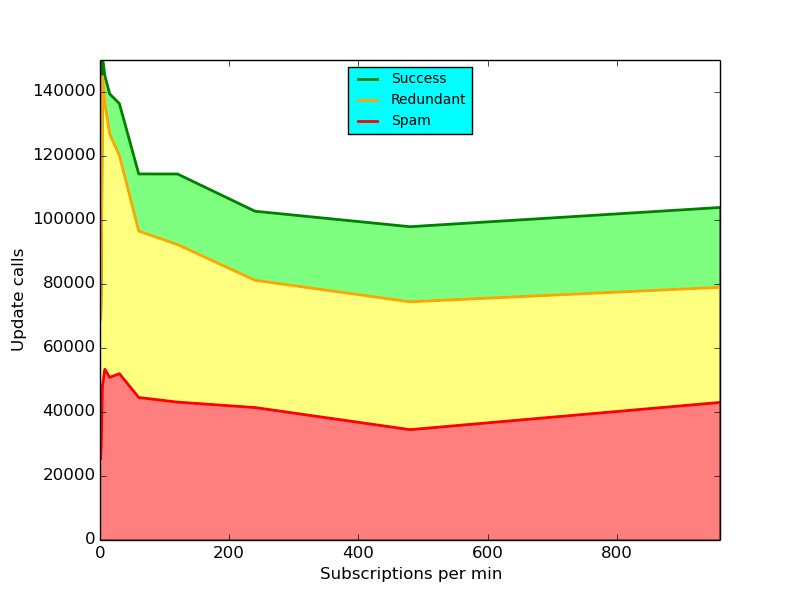

# Testing Strategy

First run quick limited tests to find out what to test extensivly.

## Test 001: Filter update frequency change (quick test)

Test what effect frequency change of subscriptions has.

Subscriptions are to random topics from random nodes.

### Constants:

 * swarm size: 400 (theoretical maximum amplification)
 * quasar size: 512 (largest possable for net rpc transfer)
 * quasar depth: 2 (limit full cascade to max 400 nodes)
 * quasar ttl: 64
 * quasar freshness: 66 (1min 6sec)
 * quasar refresh time: 60 (1min to fit in 10min test timeframe)
 * quasar extra propagations: 10

### Varibles:

 * test timedelta
 * test count

### Mesurements

 * filter update called
 * filter update successful (filters updated and maybe propagated)
 * filter update redundant (filters not updated)
 * filter update spam (call from a peer that is not a neighbor)

### Results:

Result normalization:

    # amplificaton (updates calls resulting from a subscription as percent of theoretical maximum) 
    kademlia ksize = 20
    max amplification = kademlia ksize ^ quasar depth = 400
    num refreshes = 600 / refresh time = 10
    amplification = update called / (test count + num refreshes * swarm size)
    amplification % = amplification * 100.0 / max amplification

    # saturation (percent of updated calls of theoretical maximum) 
    max node updates = num refreshes * (extra propagations + 1)
    max update called = swarm size * max node updates * kademlia ksize = 880000
    saturation % = called * 100.0 / max update called

    # update calls that led to a change in the nodes attenuated bloom filters
    update success % = success * 100.0 / update called

    # update calls that did not lead to a change in the nodes attenuated bloom filters
    update redundant % = redundant * 100.0 / update called

    # update calls not from a neighbor
    update spam % = spam * 100.0 / update called

### Interpretation / Observations

#### Increased subscriptions reduce redundant calls and improve successful calls.

This may have to do with the fact that every api call is used to update
the dht routing table if need, thus more is going on in the network the
more stable and reliable it becomes. This is a very good property.

The increase in successful filter updates could also be attributed to this,
as success and redundant call seem to be inversely correlated.

#### Increased subscriptions reduce amplificaton and saturation

This may be due to the bloom filter filling up over time and thus
increasing the rate of false positives (there are no unsubscriptions in the
test).

Does this contradict the increased update success? Should increased false 
positives not result in less update success calls? An additional test with
smaller bloom filters should be done to confirm it eventually decreases as
well.
