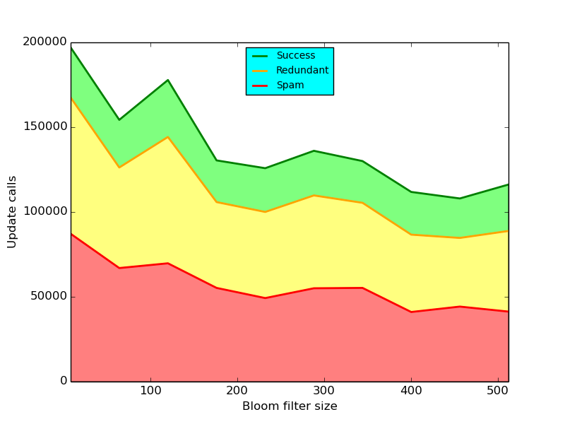
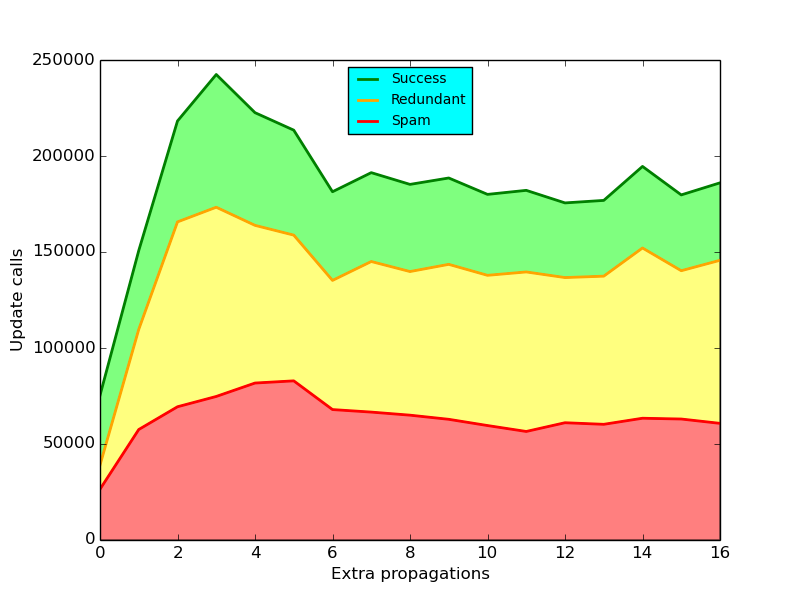

# Testing Strategy

First run quick limited tests to find out what to test extensivly.

### Mesurements

 * filter update called
 * filter update successful (filters updated and maybe propagated)
 * filter update redundant (filters not updated)
 * filter update spam (call from a peer that is not a neighbor)

## Test subscription frequency

### Constants:

 * swarm size: 400 (theoretical maximum amplification)
 * quasar size: 512 (largest possable for net rpc transfer)
 * quasar depth: 2 (limit full cascade to max 400 nodes)
 * quasar ttl: 64
 * quasar freshness: 66 (1min 6sec)
 * quasar refresh time: 60 (1min to fit in 10min test timeframe)
 * quasar extra propagations: 10

### Varibles:

 * test timedelta
 * test count

### Results:

### Interpretation / Observations

#### Increased subscriptions reduce redundant calls and improve successful calls.

This may have to do with the fact that every api call is used to update
the dht routing table if need, thus more is going on in the network the
more stable and reliable it becomes. This is a very good property.

The increase in successful filter updates could also be attributed to this,
as success and redundant call seem to be inversely correlated.

#### Increased subscriptions reduce amplificaton and saturation

This may be due to the bloom filter filling up over time and thus
increasing the rate of false positives (there are no unsubscriptions in the
test).

Does this contradict the increased update success? Should increased false 
positives not result in less update success calls? An additional test with
smaller bloom filters should be done to confirm it eventually decreases as
well.

Update: I now think this has to do with rpcudp not being very reliable and
dropping packets, but have not confirmed this yet.

## Test quasar bloom filter size

### Constants:

 * swarm size: 400 (theoretical maximum amplification)
 * quasar depth: 2 (limit full cascade to max 400 nodes)
 * quasar ttl: 64
 * quasar freshness: 66 (1min 6sec)
 * quasar refresh time: 60 (1min to fit in 10min test timeframe)
 * quasar extra propagations: 10
 * test timedelta: 0.125
 * test count: 4800

### Varibles:

 * quasar size

### Results:

### Interpretation / Observations

The tested subscription rate is not enough to saturate the quasar attenuated
bloom filters?

## Test quasar refresh rate

Test what effect different quasar refresh rates have.
Subscriptions are to random topics from random nodes.

### Constants:

 * swarm size: 400 (theoretical maximum amplification)
 * quasar depth: 2 (limit full cascade to max 400 nodes)
 * quasar ttl: 64
 * quasar extra propagations: 10
 * test timedelta: 0.125
 * test count: 4800
 * quasar size: 512

### Varibles:

 * quasar refresh time
 * quasar freshness: quasar refresh time + 6

### Results:

### Interpretation / Observations

A larger refresh interval reduces spam as each update call has a higher
likelyhood of introducing meaningfull changes.

### Conclusion

In the intrest of spam reduction the largest practical refresh interval
should be chosen.

## Test quasar extra propagations

Test what effect different quasar extra propagations have.
Subscriptions are to random topics from random nodes.

### Constants:

 * swarm size: 400 (theoretical maximum amplification)
 * quasar depth: 2 (limit full cascade to max 400 nodes)
 * quasar ttl: 64
 * quasar freshness: 66 (1min 6sec)
 * quasar refresh time: 60 (1min to fit in 10min test timeframe)
 * test timedelta: 0.125
 * test count: 4800
 * quasar size: 512

### Varibles:

 * quasar extra propagations

### Results:

### Interpretation / Observations

TODO
